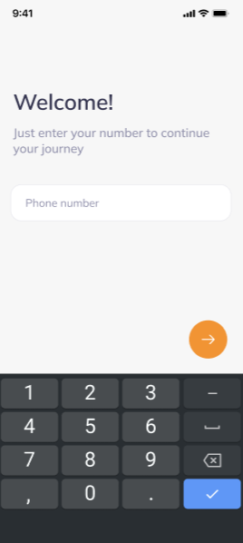
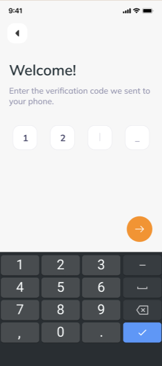
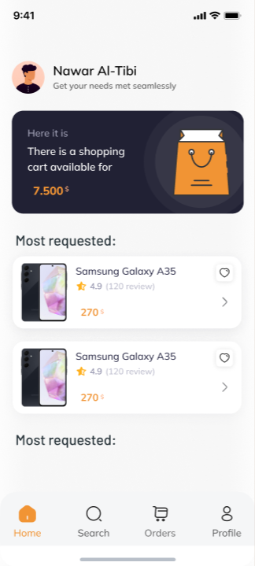
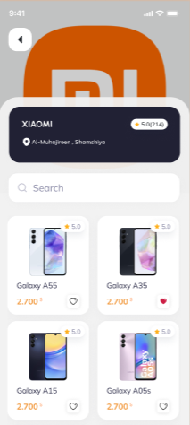
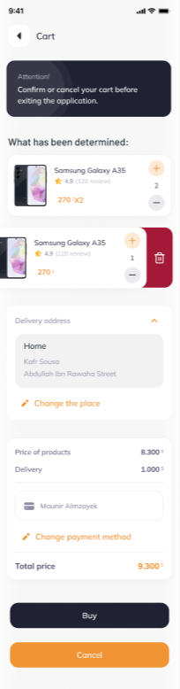
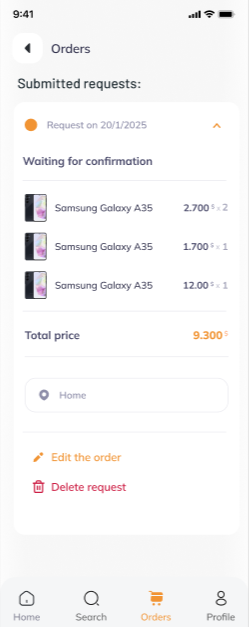
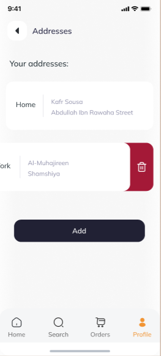
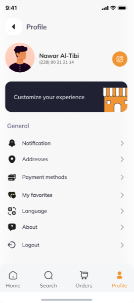
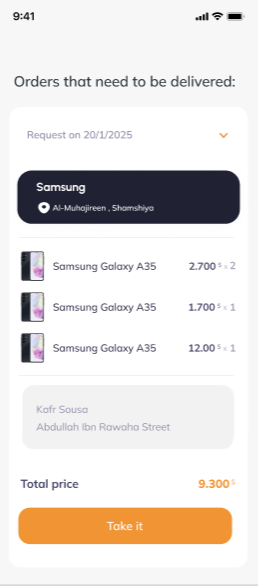

# SoldOut

A multi-vendor delivery app built with Flutter. Customers browse markets and place orders; drivers accept deliveries and complete routes with map-based navigation.

[](https://flutter.dev)
[](https://dart.dev)
[](#architecture)
[](https://pub.dev/packages/get)
[](LICENSE)

---

## Live Demo

Watch the full walkthroughs of both user roles:

| Role | Demo |
|------|------|
| **Buyer** | [Buyer.mp4](https://drive.google.com/drive/folders/1JVfOZWIWCjbeinHMCRQnBta3KeY-OB0z?usp=sharing) |
| **Driver / Delivery** | [Delivery.mp4](https://drive.google.com/drive/folders/1JVfOZWIWCjbeinHMCRQnBta3KeY-OB0z?usp=sharing) |

📁 [Open the Live Demo folder on Google Drive](https://drive.google.com/drive/folders/1JVfOZWIWCjbeinHMCRQnBta3KeY-OB0z?usp=sharing)

---

## Screenshots

### Buyer Flow

<p align="center">
  
  
  
  
</p>

<p align="center">
  
  
  
  
</p>

<p align="center">
  
  
</p>

| Screen | Description |
|--------|-------------|
| Login / OTP | Phone authentication with OTP verification |
| Home | Personalized feed, cart banner, most-requested products |
| Market / Product | Browse markets and view product details |
| Cart | Quantity controls, address & payment selection, checkout |
| Orders / Modify | Track submitted requests and edit pending orders |
| Addresses / Profile | Manage delivery locations and account settings |

### Driver Flow

<p align="center">
  
  
  
  
</p>

| Screen | Description |
|--------|-------------|
| Available Orders | List of orders waiting to be delivered |
| Order Details | Markets, products, destination, and **Take it** |
| Active Delivery | Map route with waypoints and **Done** to complete |

---

## Features

- **Role-based auth** — phone OTP login for buyers and drivers, with persistent sessions
- **Shopping cart & checkout** — stock checks, address/payment selection, order lifecycle
- **Order management** — pending → in delivery → delivered, with edit support
- **Driver routing** — OSRM trip optimization, OpenStreetMap map, polylines, geolocation
- **Bilingual UI** — English / Arabic with RTL support (Mulish / Almarai)
- **Search & pagination** — products and markets with infinite scroll
- **Extras** — favorites, addresses, payment cards, product ratings

---

## Architecture

Clean Architecture with GetX for state management, DI, and routing:

```
Presentation  →  Controllers, Pages, Widgets
Domain        →  Use Cases, Business Logic
Data          →  Repositories, Models, API Providers
```

```
lib/
├── App/              # Theme, routes, translations, utilities
├── Data/             # Models, repositories, network layer
├── Domain/           # Use cases
└── Presentation/     # Controllers, pages, widgets
```

---

## Tech Stack

| Area | Stack |
|------|--------|
| Framework | Flutter / Dart (≥3.3.1) |
| State & routing | GetX |
| Maps | flutter_map, OSRM, geolocator, polyline_points |
| Storage | SharedPreferences |
| UI | ScreenUtil, Google Fonts, SVG |

---

## Getting Started

### Prerequisites

- Flutter SDK 3.3.1+
- Android Studio / VS Code with Flutter extensions
- Running backend API

### Setup

```bash
git clone https://github.com/Nawar-Altibi/SoldOut.git
cd SoldOut
flutter pub get
```

Configure the API host in `lib/App/Const/Host.dart`:

```dart
const String host = "your-api-host:port";
```

| Environment | Host tip |
|-------------|----------|
| Android emulator | `10.0.2.2:8000` |
| Physical device | Your PC LAN IP, e.g. `192.168.1.x:8000` |
| Production | Your production API URL |

```bash
flutter run
```

### Build

```bash
# Android
flutter build apk --release
flutter build appbundle --release

# iOS
flutter build ios --release
```

---

## Key Technical Highlights

- Clean Architecture across Presentation / Domain / Data
- Reactive UI with GetX observables
- Multi-waypoint route sorting via OSRM Trip API
- Request deduplication for search and pagination
- Responsive layout with `flutter_screenutil`

---

## Author

**Mohammed Nawar Al-Tibi**

- GitHub: [@Nawar-Altibi](https://github.com/Nawar-Altibi)
- LinkedIn: [Nawar Al-Tibi](https://www.linkedin.com/in/nawar-al-tibi/)

---

*Developed as a university Programming Languages project — Flutter, Clean Architecture, and mobile delivery UX.*
